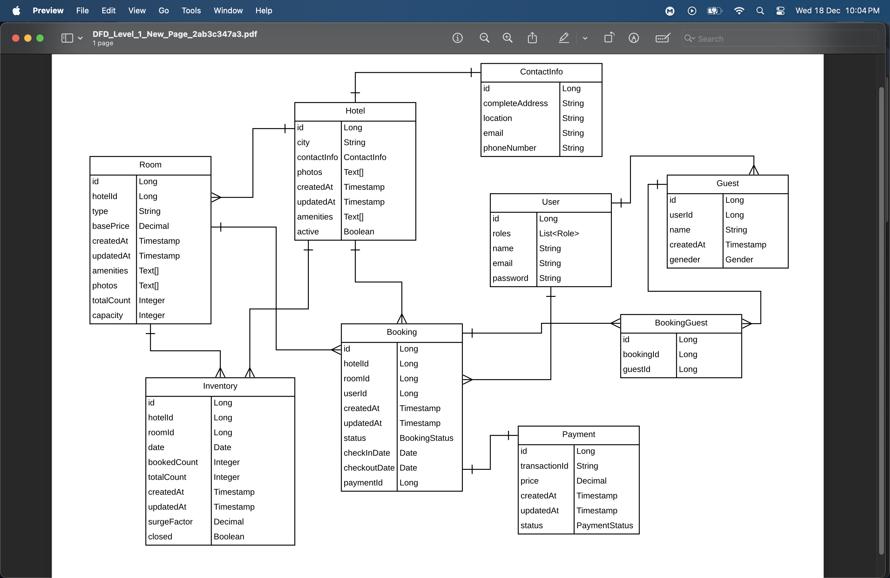

# Airbnb Clone

This project is an Airbnb clone built with **Spring Boot**. It replicates key functionalities of Airbnb, providing a platform for users to book and list properties.

---

## 🌟 Features

- User Authentication and Authorization
- Property Listing and Management
- Booking System with Real-Time Availability
- Reviews and Ratings for Properties
- Search and Filter Options
- Responsive Design

---

## 🛠️ Technologies Used

- **Backend**: Spring Boot, JPA, Hibernate
- **Database**: PostgreSQL
- **Tools**: Maven, Spring Security, RESTful APIs

---

## 📄 Class Diagram

Below is the class diagram that represents the structure of the project:

---

## 🚀 Getting Started

### Prerequisites

Make sure you have the following installed:
- Java 17+
- Maven
- PostgreSQL
